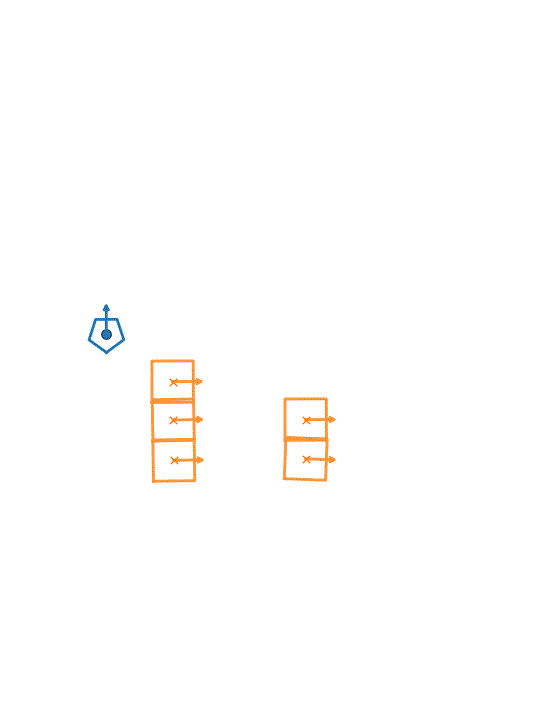

This repo is a proof of concept for some heurestic based mapping for a robot wandering around targets.

Given data.json which containts:
1. Time series of some poses for one robot relative to an origin
1. Time series of some poses for loads relative to the robot

Produce time series of load poses relative to origin complying with the conditions:
* The produced data is to be smooth i.e. implement a filtering mechanism
* The given time series from data.json are mismatched in time so they have to be processed before using.
* Given poses of loads relative to robots flip 180 degrees in angle often, the solution would require to provide a correct orientation.


Live preview (GIF)



## High-level flow

```mermaid
flowchart TD
	A[Input: data.json (robot poses, load detections)]
	B[Preprocess timelines (align timestamps, interpolate gaps)]
	C[Resolve orientation flips (handle 180 deg cases)]
	D[Transform to global frame (compose transforms)]
	E[Smooth trajectories (filter noise)]
	F[Outputs (robot_poses.json, detections_output.json)]
	G[Visualize or share (interactive plot, GIF/MP4)]

	A --> B --> C --> D --> E --> F --> G
```


How to run

- Build: `./run.sh build`
- Run the C++ program: `./run.sh run [path/to/data.json]`
	- Default input is `main/data.json` and outputs are written alongside it.
- Plot interactively: `./run.sh plot`
		- This runs `python3 plot/plot.py` and opens an interactive plot:
			- If a desktop display is available, it uses a native GUI backend (Qt5/Tk).
			- If not (e.g., devcontainer/Codespaces), it falls back to a browser-based interactive backend (WebAgg) and prints a URL/port to open.
- All-in-one: `./run.sh all`


